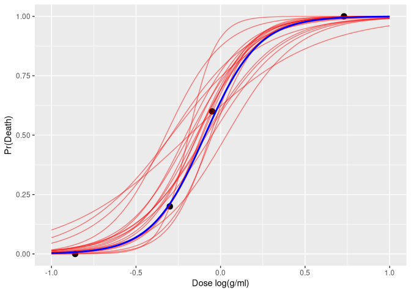

# Section 3.5 A Simple Example of Probabilistic Programming


``` r
# hard coded bioassay data from Racine-Poon et al. (1986)
df <- data.frame(
  dose = c(-0.86, -0.30, -0.05, 0.73),
  batch_size = c(5, 5, 5, 5),
  deaths = c(0, 1, 3, 5)
)

bioassay_data <- with(df, list(J = nrow(df), x = dose, n = batch_size, y = deaths))

bioassay1 <- cmdstan_model("bioassay1.stan", pedantic = TRUE)

fit1 <- bioassay1$sample(data = bioassay_data, refresh = 0)
```

    Running MCMC with 4 sequential chains...

    Chain 1 finished in 0.0 seconds.
    Chain 2 finished in 0.0 seconds.
    Chain 3 finished in 0.0 seconds.
    Chain 4 finished in 0.0 seconds.

    All 4 chains finished successfully.
    Mean chain execution time: 0.0 seconds.
    Total execution time: 0.5 seconds.

``` r
print(fit1)
```

     variable  mean median   sd  mad    q5   q95 rhat ess_bulk ess_tail
         lp__ -5.87  -5.55 0.98 0.68 -7.81 -4.96 1.00     1596     1960
         a     0.58   0.55 0.79 0.77 -0.68  1.91 1.00     1589     1489
         b     6.34   6.04 2.43 2.33  2.91 10.72 1.00     1790     2115

``` r
draws1 <- fit1$draws(format = "df")

draws1 |>
  resample_draws(ndraws = 20) |>
  expand_grid(x = seq(-1, 1, length = 100)) |>
  mutate(y = plogis(a + b * x)) |>
  ggplot() +
  geom_point(data = df, aes(x = dose, y = deaths / batch_size), size = 3) +
  geom_line(aes(x = x, y = y, group = .draw), alpha = .5, color = "red") +
  geom_function(fun = \(x) plogis(mean(draws1$a) + mean(draws1$b) * x), color = "blue", linewidth = 1) +
  labs(x = "Dose log(g/ml)", y = "Pr(Death)")
```


