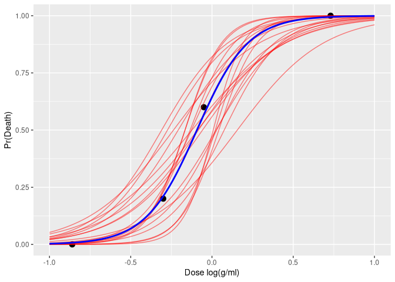
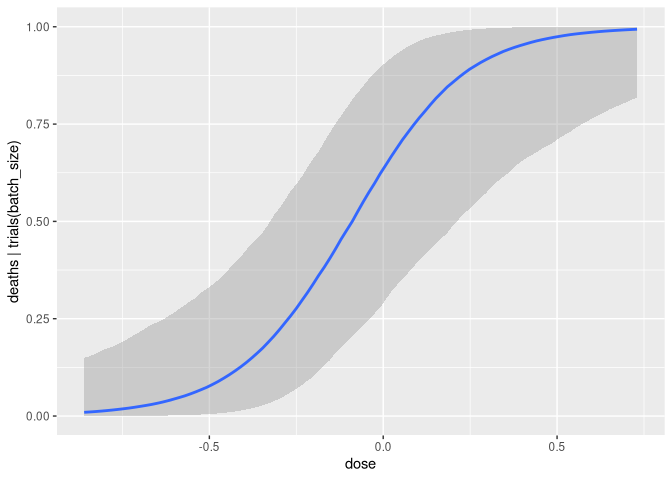
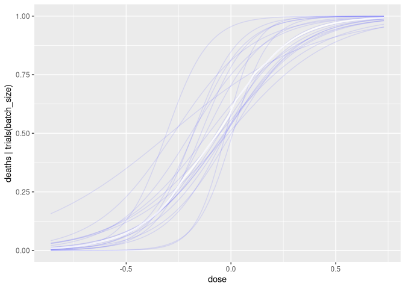

# Section 3.5 A Simple Example of Probabilistic Programming


``` r
# hard coded bioassay data from Racine-Poon et al. (1986)
df <- data.frame(
  dose = c(-0.86, -0.30, -0.05, 0.73),
  batch_size = c(5, 5, 5, 5),
  deaths = c(0, 1, 3, 5)
)

bioassay_data <- with(df, list(J = nrow(df), x = dose, n = batch_size, y = deaths))

bioassay1 <- cmdstan_model("bioassay1.stan", pedantic = TRUE)

fit1 <- bioassay1$sample(data = bioassay_data, refresh = 0)
```

    Running MCMC with 4 sequential chains...

    Chain 1 finished in 0.0 seconds.
    Chain 2 finished in 0.0 seconds.
    Chain 3 finished in 0.0 seconds.
    Chain 4 finished in 0.0 seconds.

    All 4 chains finished successfully.
    Mean chain execution time: 0.0 seconds.
    Total execution time: 0.5 seconds.

``` r
print(fit1)
```

     variable  mean median   sd  mad    q5   q95 rhat ess_bulk ess_tail
         lp__ -5.86  -5.58 0.95 0.68 -7.75 -4.96 1.00     1941     2473
         a     0.61   0.57 0.77 0.77 -0.60  1.89 1.00     1556     1835
         b     6.35   6.04 2.46 2.40  2.90 10.92 1.00     1591     2179

``` r
draws1 <- fit1$draws(format = "df")

draws1 |>
  resample_draws(ndraws = 20) |>
  expand_grid(x = seq(-1, 1, length = 100)) |>
  mutate(y = plogis(a + b * x)) |>
  ggplot() +
  geom_point(data = df, aes(x = dose, y = deaths / batch_size), size = 3) +
  geom_line(aes(x = x, y = y, group = .draw), alpha = .5, color = "red") +
  geom_function(fun = \(x) plogis(mean(draws1$a) + mean(draws1$b) * x), color = "blue", linewidth = 1) +
  labs(x = "Dose log(g/ml)", y = "Pr(Death)")
```


``` r
draws1 |>
  mutate_variables(LD50 = -a/b) |> 
  subset_draws(variable='LD50') |> 
  summarize_draws()
```

    # A tibble: 1 × 10
      variable    mean  median    sd   mad     q5   q95  rhat ess_bulk ess_tail
      <chr>      <dbl>   <dbl> <dbl> <dbl>  <dbl> <dbl> <dbl>    <dbl>    <dbl>
    1 LD50     -0.0853 -0.0946 0.129 0.112 -0.275 0.130  1.00    2229.    2348.

    Running /usr/lib64/R/bin/R CMD SHLIB foo.c
    using C compiler: ‘gcc (GCC) 16.1.1 20260625’
    gcc -I"/usr/include/R/" -DNDEBUG   -I"/home/craig/.cache/R/renv/cache/v5/linux-endeavouros-2025.02.08/R-4.6/x86_64-pc-linux-gnu/Rcpp/1.1.2/f481f89daa906a34eab8ef8658c8a89c/Rcpp/include/"  -I"/home/craig/Projects/bayesian_workflow/renv/library/linux-endeavouros-2025.02.08/R-4.6/x86_64-pc-linux-gnu/RcppEigen/include/"  -I"/home/craig/Projects/bayesian_workflow/renv/library/linux-endeavouros-2025.02.08/R-4.6/x86_64-pc-linux-gnu/RcppEigen/include/unsupported"  -I"/home/craig/Projects/bayesian_workflow/renv/library/linux-endeavouros-2025.02.08/R-4.6/x86_64-pc-linux-gnu/BH/include" -I"/home/craig/.cache/R/renv/cache/v5/linux-endeavouros-2025.02.08/R-4.6/x86_64-pc-linux-gnu/StanHeaders/2.32.10/c35dc5b81d7ffb1018aa090dff364ecb/StanHeaders/include/src/"  -I"/home/craig/.cache/R/renv/cache/v5/linux-endeavouros-2025.02.08/R-4.6/x86_64-pc-linux-gnu/StanHeaders/2.32.10/c35dc5b81d7ffb1018aa090dff364ecb/StanHeaders/include/"  -I"/home/craig/.cache/R/renv/cache/v5/linux-endeavouros-2025.02.08/R-4.6/x86_64-pc-linux-gnu/RcppParallel/5.1.11-2/03f41dbd55bb100847e38cab8ac0dde2/RcppParallel/include/"  -I"/home/craig/.cache/R/renv/cache/v5/linux-endeavouros-2025.02.08/R-4.6/x86_64-pc-linux-gnu/rstan/2.32.7/5f47b80f0db40503697eef138a31a6ef/rstan/include" -DEIGEN_NO_DEBUG  -DBOOST_DISABLE_ASSERTS  -DBOOST_PENDING_INTEGER_LOG2_HPP  -DSTAN_THREADS  -DUSE_STANC3 -DSTRICT_R_HEADERS  -DBOOST_PHOENIX_NO_VARIADIC_EXPRESSION  -D_HAS_AUTO_PTR_ETC=0  -include '/home/craig/.cache/R/renv/cache/v5/linux-endeavouros-2025.02.08/R-4.6/x86_64-pc-linux-gnu/StanHeaders/2.32.10/c35dc5b81d7ffb1018aa090dff364ecb/StanHeaders/include/stan/math/prim/fun/Eigen.hpp'  -D_REENTRANT -DRCPP_PARALLEL_USE_TBB=1   -I/usr/local/include    -fpic  -march=x86-64 -mtune=generic -O2 -pipe -fno-plt -fexceptions         -Wp,-D_FORTIFY_SOURCE=3 -Wformat -Werror=format-security         -fstack-clash-protection -fcf-protection         -fno-omit-frame-pointer -mno-omit-leaf-frame-pointer -g -ffile-prefix-map=/build/r/src=/usr/src/debug/r -flto=auto -ffat-lto-objects  -c foo.c -o foo.o
    In file included from /home/craig/Projects/bayesian_workflow/renv/library/linux-endeavouros-2025.02.08/R-4.6/x86_64-pc-linux-gnu/RcppEigen/include/Eigen/Core:19,
                     from /home/craig/Projects/bayesian_workflow/renv/library/linux-endeavouros-2025.02.08/R-4.6/x86_64-pc-linux-gnu/RcppEigen/include/Eigen/Dense:1,
                     from /home/craig/.cache/R/renv/cache/v5/linux-endeavouros-2025.02.08/R-4.6/x86_64-pc-linux-gnu/StanHeaders/2.32.10/c35dc5b81d7ffb1018aa090dff364ecb/StanHeaders/include/stan/math/prim/fun/Eigen.hpp:22,
                     from <command-line>:
    /home/craig/Projects/bayesian_workflow/renv/library/linux-endeavouros-2025.02.08/R-4.6/x86_64-pc-linux-gnu/RcppEigen/include/Eigen/src/Core/util/Macros.h:679:10: fatal error: cmath: No such file or directory
      679 | #include <cmath>
          |          ^~~~~~~
    compilation terminated.
    make: *** [/usr/lib64/R/etc/Makeconf:190: foo.o] Error 1


    SAMPLING FOR MODEL 'anon_model' NOW (CHAIN 1).
    Chain 1: 
    Chain 1: Gradient evaluation took 6e-06 seconds
    Chain 1: 1000 transitions using 10 leapfrog steps per transition would take 0.06 seconds.
    Chain 1: Adjust your expectations accordingly!
    Chain 1: 
    Chain 1: 
    Chain 1: Iteration:    1 / 2000 [  0%]  (Warmup)
    Chain 1: Iteration:  200 / 2000 [ 10%]  (Warmup)
    Chain 1: Iteration:  400 / 2000 [ 20%]  (Warmup)
    Chain 1: Iteration:  600 / 2000 [ 30%]  (Warmup)
    Chain 1: Iteration:  800 / 2000 [ 40%]  (Warmup)
    Chain 1: Iteration: 1000 / 2000 [ 50%]  (Warmup)
    Chain 1: Iteration: 1001 / 2000 [ 50%]  (Sampling)
    Chain 1: Iteration: 1200 / 2000 [ 60%]  (Sampling)
    Chain 1: Iteration: 1400 / 2000 [ 70%]  (Sampling)
    Chain 1: Iteration: 1600 / 2000 [ 80%]  (Sampling)
    Chain 1: Iteration: 1800 / 2000 [ 90%]  (Sampling)
    Chain 1: Iteration: 2000 / 2000 [100%]  (Sampling)
    Chain 1: 
    Chain 1:  Elapsed Time: 0.005 seconds (Warm-up)
    Chain 1:                0.005 seconds (Sampling)
    Chain 1:                0.01 seconds (Total)
    Chain 1: 

    SAMPLING FOR MODEL 'anon_model' NOW (CHAIN 2).
    Chain 2: 
    Chain 2: Gradient evaluation took 3e-06 seconds
    Chain 2: 1000 transitions using 10 leapfrog steps per transition would take 0.03 seconds.
    Chain 2: Adjust your expectations accordingly!
    Chain 2: 
    Chain 2: 
    Chain 2: Iteration:    1 / 2000 [  0%]  (Warmup)
    Chain 2: Iteration:  200 / 2000 [ 10%]  (Warmup)
    Chain 2: Iteration:  400 / 2000 [ 20%]  (Warmup)
    Chain 2: Iteration:  600 / 2000 [ 30%]  (Warmup)
    Chain 2: Iteration:  800 / 2000 [ 40%]  (Warmup)
    Chain 2: Iteration: 1000 / 2000 [ 50%]  (Warmup)
    Chain 2: Iteration: 1001 / 2000 [ 50%]  (Sampling)
    Chain 2: Iteration: 1200 / 2000 [ 60%]  (Sampling)
    Chain 2: Iteration: 1400 / 2000 [ 70%]  (Sampling)
    Chain 2: Iteration: 1600 / 2000 [ 80%]  (Sampling)
    Chain 2: Iteration: 1800 / 2000 [ 90%]  (Sampling)
    Chain 2: Iteration: 2000 / 2000 [100%]  (Sampling)
    Chain 2: 
    Chain 2:  Elapsed Time: 0.005 seconds (Warm-up)
    Chain 2:                0.005 seconds (Sampling)
    Chain 2:                0.01 seconds (Total)
    Chain 2: 

    SAMPLING FOR MODEL 'anon_model' NOW (CHAIN 3).
    Chain 3: 
    Chain 3: Gradient evaluation took 2e-06 seconds
    Chain 3: 1000 transitions using 10 leapfrog steps per transition would take 0.02 seconds.
    Chain 3: Adjust your expectations accordingly!
    Chain 3: 
    Chain 3: 
    Chain 3: Iteration:    1 / 2000 [  0%]  (Warmup)
    Chain 3: Iteration:  200 / 2000 [ 10%]  (Warmup)
    Chain 3: Iteration:  400 / 2000 [ 20%]  (Warmup)
    Chain 3: Iteration:  600 / 2000 [ 30%]  (Warmup)
    Chain 3: Iteration:  800 / 2000 [ 40%]  (Warmup)
    Chain 3: Iteration: 1000 / 2000 [ 50%]  (Warmup)
    Chain 3: Iteration: 1001 / 2000 [ 50%]  (Sampling)
    Chain 3: Iteration: 1200 / 2000 [ 60%]  (Sampling)
    Chain 3: Iteration: 1400 / 2000 [ 70%]  (Sampling)
    Chain 3: Iteration: 1600 / 2000 [ 80%]  (Sampling)
    Chain 3: Iteration: 1800 / 2000 [ 90%]  (Sampling)
    Chain 3: Iteration: 2000 / 2000 [100%]  (Sampling)
    Chain 3: 
    Chain 3:  Elapsed Time: 0.005 seconds (Warm-up)
    Chain 3:                0.005 seconds (Sampling)
    Chain 3:                0.01 seconds (Total)
    Chain 3: 

    SAMPLING FOR MODEL 'anon_model' NOW (CHAIN 4).
    Chain 4: 
    Chain 4: Gradient evaluation took 2e-06 seconds
    Chain 4: 1000 transitions using 10 leapfrog steps per transition would take 0.02 seconds.
    Chain 4: Adjust your expectations accordingly!
    Chain 4: 
    Chain 4: 
    Chain 4: Iteration:    1 / 2000 [  0%]  (Warmup)
    Chain 4: Iteration:  200 / 2000 [ 10%]  (Warmup)
    Chain 4: Iteration:  400 / 2000 [ 20%]  (Warmup)
    Chain 4: Iteration:  600 / 2000 [ 30%]  (Warmup)
    Chain 4: Iteration:  800 / 2000 [ 40%]  (Warmup)
    Chain 4: Iteration: 1000 / 2000 [ 50%]  (Warmup)
    Chain 4: Iteration: 1001 / 2000 [ 50%]  (Sampling)
    Chain 4: Iteration: 1200 / 2000 [ 60%]  (Sampling)
    Chain 4: Iteration: 1400 / 2000 [ 70%]  (Sampling)
    Chain 4: Iteration: 1600 / 2000 [ 80%]  (Sampling)
    Chain 4: Iteration: 1800 / 2000 [ 90%]  (Sampling)
    Chain 4: Iteration: 2000 / 2000 [100%]  (Sampling)
    Chain 4: 
    Chain 4:  Elapsed Time: 0.005 seconds (Warm-up)
    Chain 4:                0.005 seconds (Sampling)
    Chain 4:                0.01 seconds (Total)
    Chain 4: 

``` r
bfit1
```

     Family: binomial 
      Links: mu = logit 
    Formula: deaths | trials(batch_size) ~ dose 
       Data: df (Number of observations: 4) 
      Draws: 4 chains, each with iter = 2000; warmup = 1000; thin = 1;
             total post-warmup draws = 4000

    Regression Coefficients:
              Estimate Est.Error l-95% CI u-95% CI Rhat Bulk_ESS Tail_ESS
    Intercept     0.64      0.80    -0.87     2.35 1.00     1843     1907
    dose          6.48      2.63     2.33    12.40 1.00     2895     1940

    Draws were sampled using sampling(NUTS). For each parameter, Bulk_ESS
    and Tail_ESS are effective sample size measures, and Rhat is the potential
    scale reduction factor on split chains (at convergence, Rhat = 1).

``` r
# hard coded bioassay data from Racine-Poon et al. (1986)
df <- data.frame(
  dose = c(-0.86, -0.30, -0.05, 0.73),
  batch_size = c(5, 5, 5, 5),
  deaths = c(0, 1, 3, 5)
)

bioassay_data <- with(df, list(J = nrow(df), x = dose, n = batch_size, y = deaths))

bioassay1 <- cmdstan_model("bioassay1.stan", pedantic = TRUE)

fit1 <- bioassay1$sample(data = bioassay_data, refresh = 0)
```

    Running MCMC with 4 sequential chains...

    Chain 1 finished in 0.0 seconds.
    Chain 2 finished in 0.0 seconds.
    Chain 3 finished in 0.0 seconds.
    Chain 4 finished in 0.0 seconds.

    All 4 chains finished successfully.
    Mean chain execution time: 0.0 seconds.
    Total execution time: 0.4 seconds.

``` r
print(fit1)
```

     variable  mean median   sd  mad    q5   q95 rhat ess_bulk ess_tail
         lp__ -5.89  -5.56 1.01 0.69 -7.87 -4.95 1.00     1615     1405
         a     0.59   0.56 0.78 0.78 -0.64  1.92 1.00     2034     1887
         b     6.37   6.08 2.47 2.38  2.89 10.87 1.00     1856     1812

``` r
draws1 <- fit1$draws(format = "df")

draws1 |>
  resample_draws(ndraws = 20) |>
  expand_grid(x = seq(-1, 1, length = 100)) |>
  mutate(y = plogis(a + b * x)) |>
  ggplot() +
  geom_point(data = df, aes(x = dose, y = deaths / batch_size), size = 3) +
  geom_line(aes(x = x, y = y, group = .draw), alpha = .5, color = "red") +
  geom_function(fun = \(x) plogis(mean(draws1$a) + mean(draws1$b) * x), color = "blue", linewidth = 1) +
  labs(x = "Dose log(g/ml)", y = "Pr(Death)")
```



``` r
draws1 |>
  mutate_variables(LD50 = -a/b) |> 
  subset_draws(variable='LD50') |> 
  summarize_draws()
```

    # A tibble: 1 × 10
      variable    mean  median    sd   mad     q5   q95  rhat ess_bulk ess_tail
      <chr>      <dbl>   <dbl> <dbl> <dbl>  <dbl> <dbl> <dbl>    <dbl>    <dbl>
    1 LD50     -0.0833 -0.0920 0.132 0.115 -0.275 0.141  1.00    2819.    2466.

    Running /usr/lib64/R/bin/R CMD SHLIB foo.c
    using C compiler: ‘gcc (GCC) 16.1.1 20260625’
    gcc -I"/usr/include/R/" -DNDEBUG   -I"/home/craig/.cache/R/renv/cache/v5/linux-endeavouros-2025.02.08/R-4.6/x86_64-pc-linux-gnu/Rcpp/1.1.2/f481f89daa906a34eab8ef8658c8a89c/Rcpp/include/"  -I"/home/craig/Projects/bayesian_workflow/renv/library/linux-endeavouros-2025.02.08/R-4.6/x86_64-pc-linux-gnu/RcppEigen/include/"  -I"/home/craig/Projects/bayesian_workflow/renv/library/linux-endeavouros-2025.02.08/R-4.6/x86_64-pc-linux-gnu/RcppEigen/include/unsupported"  -I"/home/craig/Projects/bayesian_workflow/renv/library/linux-endeavouros-2025.02.08/R-4.6/x86_64-pc-linux-gnu/BH/include" -I"/home/craig/.cache/R/renv/cache/v5/linux-endeavouros-2025.02.08/R-4.6/x86_64-pc-linux-gnu/StanHeaders/2.32.10/c35dc5b81d7ffb1018aa090dff364ecb/StanHeaders/include/src/"  -I"/home/craig/.cache/R/renv/cache/v5/linux-endeavouros-2025.02.08/R-4.6/x86_64-pc-linux-gnu/StanHeaders/2.32.10/c35dc5b81d7ffb1018aa090dff364ecb/StanHeaders/include/"  -I"/home/craig/.cache/R/renv/cache/v5/linux-endeavouros-2025.02.08/R-4.6/x86_64-pc-linux-gnu/RcppParallel/5.1.11-2/03f41dbd55bb100847e38cab8ac0dde2/RcppParallel/include/"  -I"/home/craig/.cache/R/renv/cache/v5/linux-endeavouros-2025.02.08/R-4.6/x86_64-pc-linux-gnu/rstan/2.32.7/5f47b80f0db40503697eef138a31a6ef/rstan/include" -DEIGEN_NO_DEBUG  -DBOOST_DISABLE_ASSERTS  -DBOOST_PENDING_INTEGER_LOG2_HPP  -DSTAN_THREADS  -DUSE_STANC3 -DSTRICT_R_HEADERS  -DBOOST_PHOENIX_NO_VARIADIC_EXPRESSION  -D_HAS_AUTO_PTR_ETC=0  -include '/home/craig/.cache/R/renv/cache/v5/linux-endeavouros-2025.02.08/R-4.6/x86_64-pc-linux-gnu/StanHeaders/2.32.10/c35dc5b81d7ffb1018aa090dff364ecb/StanHeaders/include/stan/math/prim/fun/Eigen.hpp'  -D_REENTRANT -DRCPP_PARALLEL_USE_TBB=1   -I/usr/local/include    -fpic  -march=x86-64 -mtune=generic -O2 -pipe -fno-plt -fexceptions         -Wp,-D_FORTIFY_SOURCE=3 -Wformat -Werror=format-security         -fstack-clash-protection -fcf-protection         -fno-omit-frame-pointer -mno-omit-leaf-frame-pointer -g -ffile-prefix-map=/build/r/src=/usr/src/debug/r -flto=auto -ffat-lto-objects  -c foo.c -o foo.o
    In file included from /home/craig/Projects/bayesian_workflow/renv/library/linux-endeavouros-2025.02.08/R-4.6/x86_64-pc-linux-gnu/RcppEigen/include/Eigen/Core:19,
                     from /home/craig/Projects/bayesian_workflow/renv/library/linux-endeavouros-2025.02.08/R-4.6/x86_64-pc-linux-gnu/RcppEigen/include/Eigen/Dense:1,
                     from /home/craig/.cache/R/renv/cache/v5/linux-endeavouros-2025.02.08/R-4.6/x86_64-pc-linux-gnu/StanHeaders/2.32.10/c35dc5b81d7ffb1018aa090dff364ecb/StanHeaders/include/stan/math/prim/fun/Eigen.hpp:22,
                     from <command-line>:
    /home/craig/Projects/bayesian_workflow/renv/library/linux-endeavouros-2025.02.08/R-4.6/x86_64-pc-linux-gnu/RcppEigen/include/Eigen/src/Core/util/Macros.h:679:10: fatal error: cmath: No such file or directory
      679 | #include <cmath>
          |          ^~~~~~~
    compilation terminated.
    make: *** [/usr/lib64/R/etc/Makeconf:190: foo.o] Error 1


    SAMPLING FOR MODEL 'anon_model' NOW (CHAIN 1).
    Chain 1: 
    Chain 1: Gradient evaluation took 1.1e-05 seconds
    Chain 1: 1000 transitions using 10 leapfrog steps per transition would take 0.11 seconds.
    Chain 1: Adjust your expectations accordingly!
    Chain 1: 
    Chain 1: 
    Chain 1: Iteration:    1 / 2000 [  0%]  (Warmup)
    Chain 1: Iteration:  200 / 2000 [ 10%]  (Warmup)
    Chain 1: Iteration:  400 / 2000 [ 20%]  (Warmup)
    Chain 1: Iteration:  600 / 2000 [ 30%]  (Warmup)
    Chain 1: Iteration:  800 / 2000 [ 40%]  (Warmup)
    Chain 1: Iteration: 1000 / 2000 [ 50%]  (Warmup)
    Chain 1: Iteration: 1001 / 2000 [ 50%]  (Sampling)
    Chain 1: Iteration: 1200 / 2000 [ 60%]  (Sampling)
    Chain 1: Iteration: 1400 / 2000 [ 70%]  (Sampling)
    Chain 1: Iteration: 1600 / 2000 [ 80%]  (Sampling)
    Chain 1: Iteration: 1800 / 2000 [ 90%]  (Sampling)
    Chain 1: Iteration: 2000 / 2000 [100%]  (Sampling)
    Chain 1: 
    Chain 1:  Elapsed Time: 0.006 seconds (Warm-up)
    Chain 1:                0.005 seconds (Sampling)
    Chain 1:                0.011 seconds (Total)
    Chain 1: 

    SAMPLING FOR MODEL 'anon_model' NOW (CHAIN 2).
    Chain 2: 
    Chain 2: Gradient evaluation took 3e-06 seconds
    Chain 2: 1000 transitions using 10 leapfrog steps per transition would take 0.03 seconds.
    Chain 2: Adjust your expectations accordingly!
    Chain 2: 
    Chain 2: 
    Chain 2: Iteration:    1 / 2000 [  0%]  (Warmup)
    Chain 2: Iteration:  200 / 2000 [ 10%]  (Warmup)
    Chain 2: Iteration:  400 / 2000 [ 20%]  (Warmup)
    Chain 2: Iteration:  600 / 2000 [ 30%]  (Warmup)
    Chain 2: Iteration:  800 / 2000 [ 40%]  (Warmup)
    Chain 2: Iteration: 1000 / 2000 [ 50%]  (Warmup)
    Chain 2: Iteration: 1001 / 2000 [ 50%]  (Sampling)
    Chain 2: Iteration: 1200 / 2000 [ 60%]  (Sampling)
    Chain 2: Iteration: 1400 / 2000 [ 70%]  (Sampling)
    Chain 2: Iteration: 1600 / 2000 [ 80%]  (Sampling)
    Chain 2: Iteration: 1800 / 2000 [ 90%]  (Sampling)
    Chain 2: Iteration: 2000 / 2000 [100%]  (Sampling)
    Chain 2: 
    Chain 2:  Elapsed Time: 0.005 seconds (Warm-up)
    Chain 2:                0.004 seconds (Sampling)
    Chain 2:                0.009 seconds (Total)
    Chain 2: 

    SAMPLING FOR MODEL 'anon_model' NOW (CHAIN 3).
    Chain 3: 
    Chain 3: Gradient evaluation took 2e-06 seconds
    Chain 3: 1000 transitions using 10 leapfrog steps per transition would take 0.02 seconds.
    Chain 3: Adjust your expectations accordingly!
    Chain 3: 
    Chain 3: 
    Chain 3: Iteration:    1 / 2000 [  0%]  (Warmup)
    Chain 3: Iteration:  200 / 2000 [ 10%]  (Warmup)
    Chain 3: Iteration:  400 / 2000 [ 20%]  (Warmup)
    Chain 3: Iteration:  600 / 2000 [ 30%]  (Warmup)
    Chain 3: Iteration:  800 / 2000 [ 40%]  (Warmup)
    Chain 3: Iteration: 1000 / 2000 [ 50%]  (Warmup)
    Chain 3: Iteration: 1001 / 2000 [ 50%]  (Sampling)
    Chain 3: Iteration: 1200 / 2000 [ 60%]  (Sampling)
    Chain 3: Iteration: 1400 / 2000 [ 70%]  (Sampling)
    Chain 3: Iteration: 1600 / 2000 [ 80%]  (Sampling)
    Chain 3: Iteration: 1800 / 2000 [ 90%]  (Sampling)
    Chain 3: Iteration: 2000 / 2000 [100%]  (Sampling)
    Chain 3: 
    Chain 3:  Elapsed Time: 0.005 seconds (Warm-up)
    Chain 3:                0.005 seconds (Sampling)
    Chain 3:                0.01 seconds (Total)
    Chain 3: 

    SAMPLING FOR MODEL 'anon_model' NOW (CHAIN 4).
    Chain 4: 
    Chain 4: Gradient evaluation took 2e-06 seconds
    Chain 4: 1000 transitions using 10 leapfrog steps per transition would take 0.02 seconds.
    Chain 4: Adjust your expectations accordingly!
    Chain 4: 
    Chain 4: 
    Chain 4: Iteration:    1 / 2000 [  0%]  (Warmup)
    Chain 4: Iteration:  200 / 2000 [ 10%]  (Warmup)
    Chain 4: Iteration:  400 / 2000 [ 20%]  (Warmup)
    Chain 4: Iteration:  600 / 2000 [ 30%]  (Warmup)
    Chain 4: Iteration:  800 / 2000 [ 40%]  (Warmup)
    Chain 4: Iteration: 1000 / 2000 [ 50%]  (Warmup)
    Chain 4: Iteration: 1001 / 2000 [ 50%]  (Sampling)
    Chain 4: Iteration: 1200 / 2000 [ 60%]  (Sampling)
    Chain 4: Iteration: 1400 / 2000 [ 70%]  (Sampling)
    Chain 4: Iteration: 1600 / 2000 [ 80%]  (Sampling)
    Chain 4: Iteration: 1800 / 2000 [ 90%]  (Sampling)
    Chain 4: Iteration: 2000 / 2000 [100%]  (Sampling)
    Chain 4: 
    Chain 4:  Elapsed Time: 0.005 seconds (Warm-up)
    Chain 4:                0.004 seconds (Sampling)
    Chain 4:                0.009 seconds (Total)
    Chain 4: 

``` r
bfit1
```

     Family: binomial 
      Links: mu = logit 
    Formula: deaths | trials(batch_size) ~ dose 
       Data: df (Number of observations: 4) 
      Draws: 4 chains, each with iter = 2000; warmup = 1000; thin = 1;
             total post-warmup draws = 4000

    Regression Coefficients:
              Estimate Est.Error l-95% CI u-95% CI Rhat Bulk_ESS Tail_ESS
    Intercept     0.60      0.79    -0.89     2.23 1.00     2447     1925
    dose          6.40      2.52     2.38    12.19 1.00     2546     2169

    Draws were sampled using sampling(NUTS). For each parameter, Bulk_ESS
    and Tail_ESS are effective sample size measures, and Rhat is the potential
    scale reduction factor on split chains (at convergence, Rhat = 1).

``` r
plot(conditional_effects(bfit1))
```



``` r
plot(conditional_effects(bfit1, spaghetti = TRUE,ndraws=20))
```


